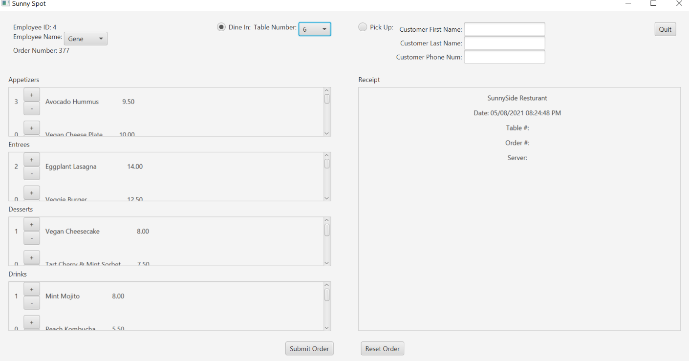
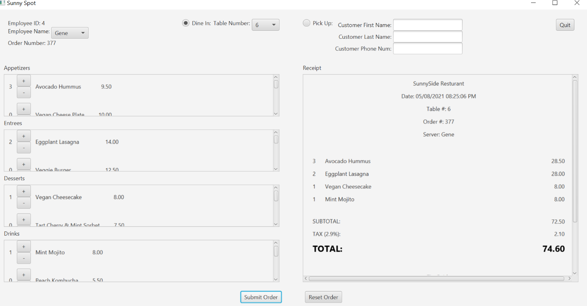

# Receipt-Generator
Java Receipt Generator Program - Built with JavaFX

This is a Java program that allows a resturant employee to enter customer data, order types, menu items per order, and generate a reciept based on the data. The reciept is capable of calculating the subtotal as well as a total based on a tax percentage. An employee can reset receipts and generate an infinite amount. 

## Screenshots

